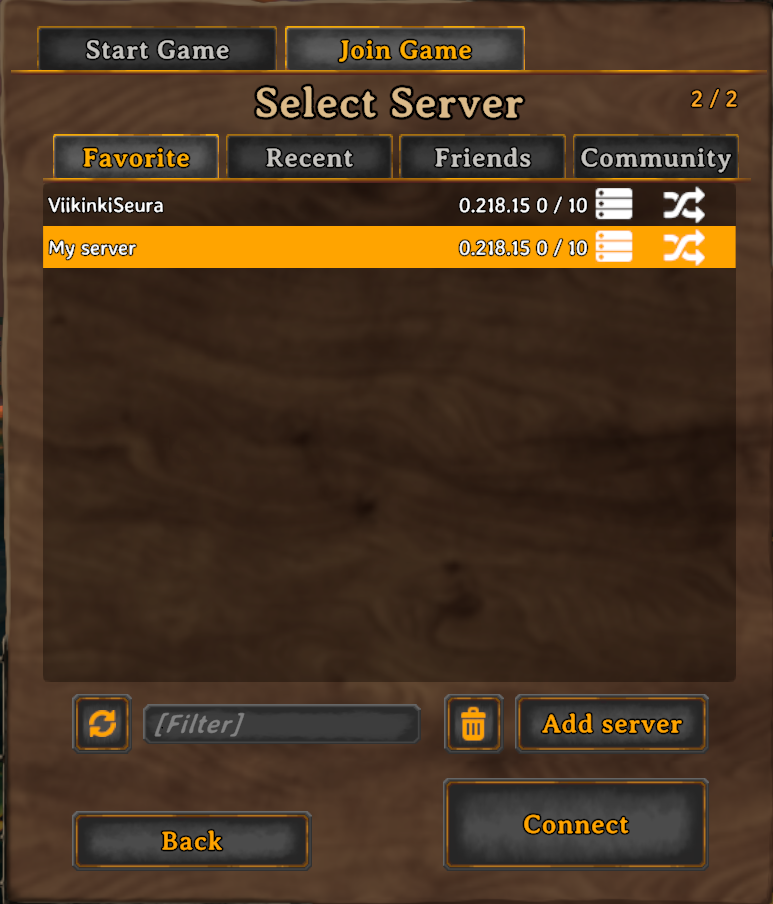

# vjihanak/lightweight-valheim-server-and-bot

This repository is the home for vjihanak/lightweight-valheim-server-and-bot docker project for linux. The image spins up a lightweight server with crossplay enabled (e.g. supports xbox gamepass version) and synchronously starts a script that sends information to telegram about the server output.
Current information sent includes:

- Player joining along with a name and player count
- Player disconnect along with player count
- Notification about raids
- Player deaths

# How to start

### Prerequisities:
- [Docker](https://docs.docker.com/engine/install/ubuntu/)
- [Telegram bot API token](https://ihanakangas.fi/2024/05/30/creating-a-telegram-bot/)
- [Telegram chat id](https://ihanakangas.fi/2024/05/30/creating-a-telegram-bot/)

A simple shell script is provided in this repository that should enable an easy start of the server. Prerequisities mentioned above need to be installed and acquired before trying to start the server. To start the server, copy the shell script (or the contents below) to a place of your choosing, modify the contents as needed and run the script. The script should then download the image from dockerhub and start the needed processes. Explanation of contents can be found below. Port forwarding should not be needed as the image utilizes the -crossplay option, but enabling port forwarding for the selected port does not hurt the process. On the first start, it takes several minutes for the server to start. Once the container log says `"Starting to read log..."` the server should be up and running. See more information about joining in the "How to join"-section

```
#!/bin/bash
SERVER_DATA = "$HOME/valheim-server/data"
mkdir -p $SERVER_DATA
docker run -d \
  --name valheim-server \
  --cap-add=sys_nice \
  -p 2456/udp \
  -v ~/world/location:/home/valheim/provided_world \
  -v $SERVER_DATA:/home/valheim/valheim-server \
  -e SERVER_NAME="My server" \
  -e SERVER_PORT=2456 \
  -e SERVER_PASSWORD="secret" \
  -e WORLD_NAME="worldname" \
  -e TG_API_TOKEN="your:token" \
  -e TG_CHAT_ID="chatid" \
  vjihanak/lightweight-valheim-server-and-bot
```

### All lines and keys explained:

| Line/Key | Explanation |
|------------|-------|
| SERVER_DATA | Path to a directory that will be created (on host) for easier handling of server files. Will be mounted at startup.
| --name  | Docker container name.
| -p | Container's port to open to the host (Must match PORT key below).
| -v ~/world/location:/home/valheim/provided_world | Path to the directory for using existing saves. Change "~/world/location" to a path that contains your save file. If existing save files are NOT used, remove this line. (On linux the local save files are located in `$HOME/.config/unity3d/IronGate/Valheim/worlds`. File extensions are .db and .fwl).
| SERVER_NAME | Name that will be displayed in the server list in game.
| SERVER_PORT | Port that will be used for connection to the server (Must match -p option above).
| SERVER_PASSWORD | Server password. Must be at least 6 characters and can not be found in server name. (Server does not start if these requirements are not met).
| WORLD_NAME | Game save file name (.db and .fwl). Must match the name of the existing save file if in use, otherwise set to your liking and the server will create a new world/save.
| TG_API_TOKEN | Api token for a telegram bot.
| TG_CHAT_ID | Telegram group chat id.

## What this image does for you
- Sets up and starts a lightweight valheim server.
- Starts a script that posts notifications in a telegram chat of your choosing.

## What this image does NOT do for you
- Take backups from the server.
- Setup any service that enables server monitoring.
- Notify in any other service other than telegram.

The idea of this image is to be as simple as possible, removing the need for having any extra services that confuse the user on what is needed and what isn't.

# Updates
Currently the server does not auto update. If a new version of the game and server is published, stop the container/process gracefully and copy the save files manually. `docker cp <container_id>:/home/valheim/.config/unity3d/IronGate/Valheim/worlds_local /path/to/destination_on_host` The server saves automatically every 20 minutes and attempts to save when the process is stopped. The server save file directory is not mounted on startup for technical reasons. Alternative options for easier save file handling might be worked on in the future.

# How to join
To join the server you need your public ip/dns and the port provided in the start script. Once you start the game, click on "Start game" -> "Join game" from the upper corner -> "Add server" -> write the address and port to the opening window (as.an.example:2456) -> save server -> choose from the list (as shown below) and connect.


